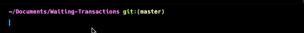
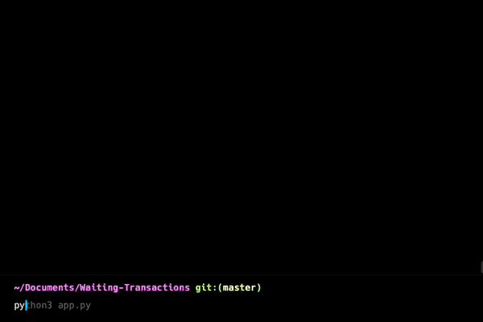

# Waiting Transactions
----

Get all the pending as well as queued transactions for a EVM based blockchain using *[web3.py](https://web3py.readthedocs.io/en/stable/)* and your desired RPC endpoint.
Get Transactions that are waiting to be mined (Pending Transactions) as well as the transactions that are not executed (Queued Transactions).

This projects uses an HTTPS endpoint to access a blockchain network by connecting to the RPC endpoint of a blockhain node.

## Using The Project

-----

### Step 1
#### Install Dependencies

Its a standard python project and the required packages can be installed using the pip package manager.
To install the required packages run the following command-
```
pip install -r requirements.txt
````

---

### Step 2
#### Specifying The RPC Endpoint

The project takes RPC endpoint from the environment variables. export your endpoint to the variable ```RPC_URL``` by running the command-
```
export RPC_URL=<Your URL>
```
<br>
<div align="center" class="row">
  
</div>
<br>

---

### Step 3
#### Run The Application

Run the application using the command-
```
python app.py
```
<br>
<div align="center" class="row">
  
</div>
<br>

---

## Transactions

The transactions are printed in JSON format with transactions being grouped by the sender's address and then showing each transaction using the nonce of the transaction. The transactions are printed in following format-

```
{
    <Sender's Addres>: {
        <Nonce Of Transaction>: {
            "blockHash":
            "blockNumber":
            "gas":
            "gasPrice":
            "maxFeePerGas":
            "maxPrirotyFeePerGas":
            "hash":
            "inpuy":
            "nonce":
        }
    }
}

```

----
For any queries do reach out at *subhasishgoswami00@gmail.com*